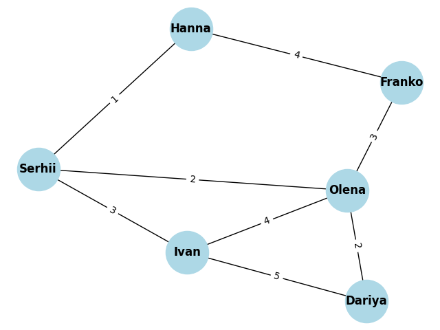

# Завдання 1:

Створимо мережу друзів, де кожна вершина представляє особу, а ребра показують зв'язки між ними.
Кількість вершин у графі: 6
Кількість ребер у графі: 8
Ступінь кожної вершини у графі:

    {'Hanna': 2, 'Serhii': 3, 'Ivan': 3,
    'Dariya': 2, 'Olena': 4, 'Franko': 2}

# Завдання 2:

Шляхи за допомогою DFS:
    
    [
        ['Serhii', 'Hanna', 'Franko'],
        ['Serhii', 'Olena', 'Franko'],
        ['Serhii', 'Ivan', 'Olena', 'Franko'],
        ['Serhii', 'Ivan', 'Dariya', 'Olena', 'Franko']
    ]

Шляхи за допомогою BFS:
    
    [
        ['Serhii', 'Olena', 'Franko'],
        ['Serhii', 'Hanna', 'Franko'],
        ['Serhii', 'Ivan', 'Olena', 'Franko'],
        ['Serhii', 'Ivan', 'Dariya', 'Olena', 'Franko']
    ]

В нашому випадку шляхи майже схожі тому що граф замкнутий тобто він немає вершин які мають лише 1 зв'язок. Тому пошук в ширину (BFS) або в глибину (DFS) дає схожий результат.

# Завдання 3:

Грав з вершинами та вагами ребер:

Найкоротші шляхи від вершини Hanna:
    
    {'Hanna': 0, 'Serhii': 1, 'Olena': 3, 'Franko': 4, 'Ivan': 4, 'Dariya': 5}

Найкоротші шляхи від вершини Serhii:
    
    {'Serhii': 0, 'Hanna': 1, 'Olena': 2, 'Ivan': 3, 'Dariya': 4, 'Franko': 5}

Найкоротші шляхи від вершини Ivan:
    
    {'Ivan': 0, 'Serhii': 3, 'Olena': 4, 'Hanna': 4, 'Dariya': 5, 'Franko': 7}

Найкоротші шляхи від вершини Dariya:
    
    {'Dariya': 0, 'Olena': 2, 'Serhii': 4, 'Ivan': 5, 'Franko': 5, 'Hanna': 5}

Найкоротші шляхи від вершини Olena:

    {'Olena': 0, 'Serhii': 2, 'Dariya': 2, 'Franko': 3, 'Hanna': 3, 'Ivan': 4}

Найкоротші шляхи від вершини Franko:

    {'Franko': 0, 'Olena': 3, 'Hanna': 4, 'Serhii': 5, 'Dariya': 5, 'Ivan': 7}